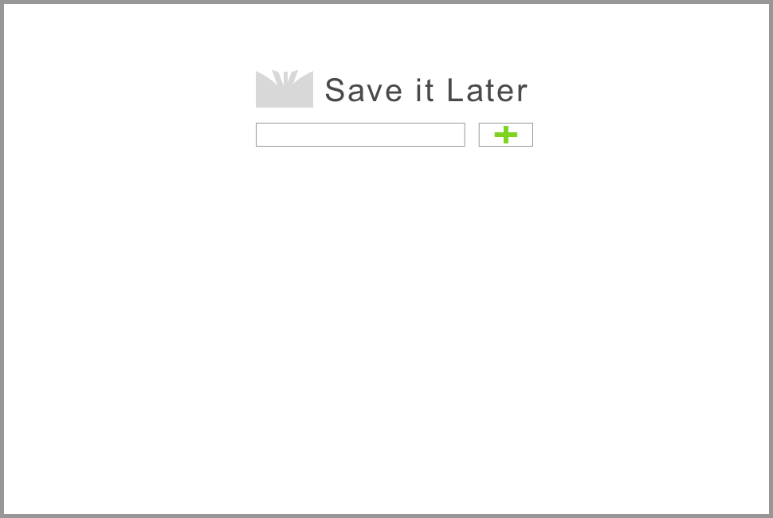
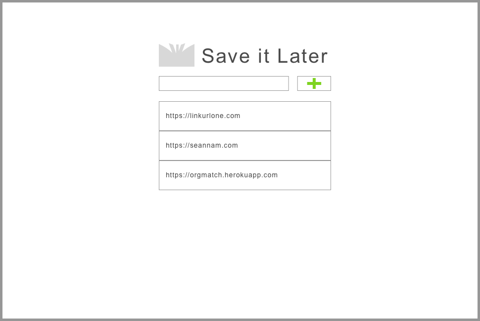
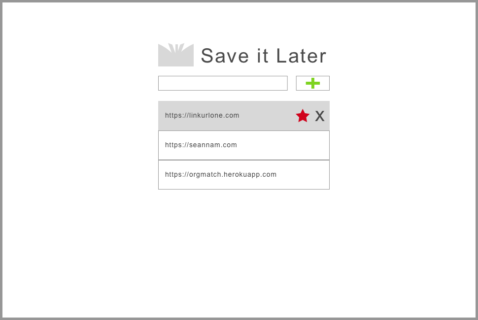
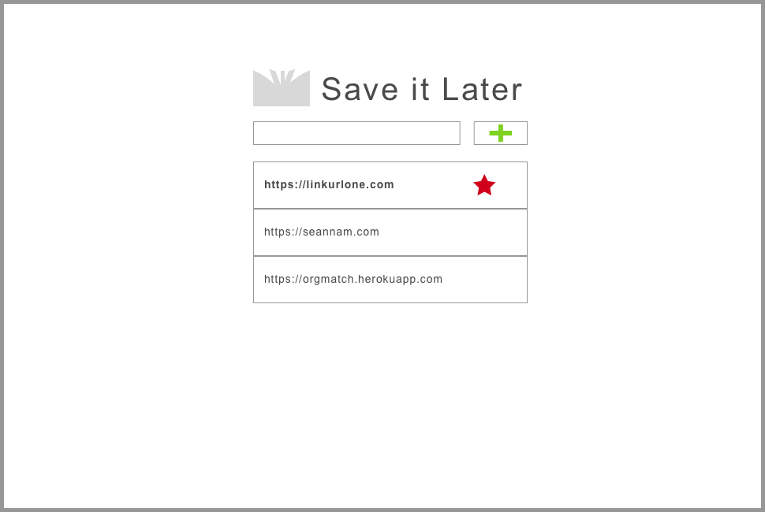

# Save For Later
For all those videos, gifs, and memes you find on the internet.

## User Stories  
## Part 1 - Basic HTML, CSS, & JavaScript  
[ ] Basic Layout

[ ] As a user, I want to add a new link to my list  
  
[ ] As a user, I want to delete a link  
  
[ ] As a user, I want to favorite a link so that it stands out
  
[ ] As a user, I want to open a link in a new window from my list  

## Part 2A - Node
[ ] As a user, I want my links organized by dates    
[ ] As a user, I want to save my list to my account so I can access it anywhere  
[ ] As a user, I want to see a thumbnail preview of each link  

## Part 2B - MongoDB
[ ] As a user, I want to search through all my links  
[ ] As a user, I want to sort my list by date in ascending and descending order  