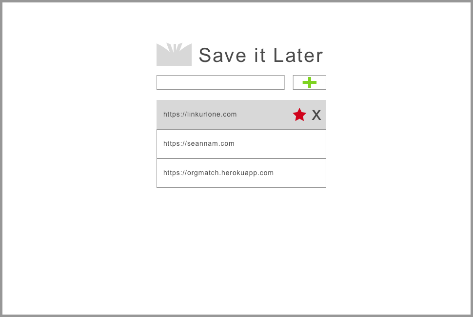

## Agile software development cycle
#### Git
1. If you don't have the Git CLI (*do not use GitHub Desktop*), run through [this guide to installing Git](https://git-scm.com/book/en/v2/Getting-Started-Installing-Git).
2. If you're not too familiar with Git (e.g. you don't quite understand how branches/merging works), complete [this Git tutorial](https://try.github.io).
3. Read [this quick article on writing good commit messages](https://chris.beams.io/posts/git-commit/).

#### Kanban boards
Just update your progress on the repo's Kanban Boards as you go along. I'll set these up beforehand for everyone, with pre-populated and assigned issues for everyone to complete. This is under the *Projects* tab on the repo page.

#### HTML/CSS/JavaScript

1. If you're not familiar with HTML/CSS, complete the ["Learn HTML"](https://www.codecademy.com/learn/learn-html) and ["Learn CSS"](https://www.codecademy.com/learn/learn-css) Codecademy courses.
2. If you're not familiar with JavaScript, complete [the "Introduction to JavaScript" Codecademy course](https://www.codecademy.com/learn/introduction-to-javascript).
3. Complete [the "Make a Website" Codecademy course](https://www.codecademy.com/learn/make-a-website).
4. Clone this repo.
5. Create your own branch (duplicate the `master` branch).
6. Start on Part 1 of [Mini Project 1 - Save For Later](sprint-1/saveforlater.md)

## Save For Later
For all those videos, gifs, and memes you find on the internet.

## User Stories  
### Part 1 - Basic HTML, CSS, & JavaScript  
Basic Layout

As a user, I want to add a new link to my list  
  
As a user, I want to delete a link  
  
As a user, I want to favorite a link so that it stands out
  
As a user, I want to open a link in a new window from my list  

### Part 2A - Node
- As a user, I want my links organized by dates    
- As a user, I want to save my list to my account so I can access it anywhere  
- As a user, I want to see a thumbnail preview of each link  

### Part 2B - MongoDB
- As a user, I want to search through all my links  
- As a user, I want to sort my list by date in ascending and descending order  